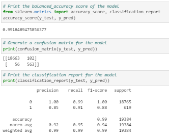
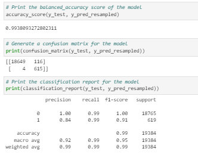

# credit_risk_logistic_regression_resampling
Using logistic regression and resampling to evaluate credit-worthiness.

---

## Technologies

This project leverages python 3.7 with the following packages:

* [pandas] (https://github.com/pandas-dev/pandas) - For data manipulation and analysis.

* [pathlib] (https://github.com/budlight/pathlib) - For importing cvs files using standarized file path notation.

* [imblearn] (https://github.com/scikit-learn-contrib/imbalanced-learn/blob/master/imblearn/pipeline.py) - For classification reports.

* [sklearn] (https://github.com/scikit-learn/scikit-learn) - For machine learning built on top of SciPy.

* [numpy] (https://github.com/numpy/numpy) - For scientific computing.

---

## Datasets

Dataset pulled from Resources folder which contains csv file.

## Usage

### General

This is designed to be run in jupyter lab. Upon launching credit_risk_resampling.ipynb run each cell sequentially, ensuring to import the required libraries.

### Model 1

This model uses LogisticRegression on the data from the lending_data.csv
The prediction of this model has the following accuarcy score, confusion matrix and classifcation report.

This model also uses LogisticRegression however it used resampled data from the lending_data.csv so that we have more instances of the high-risk loans to balance the data.
The prediction of this model has the following accuarcy score, confusion matrix and classifcation report.

The analysis of these findings can be read in report-template.md.

